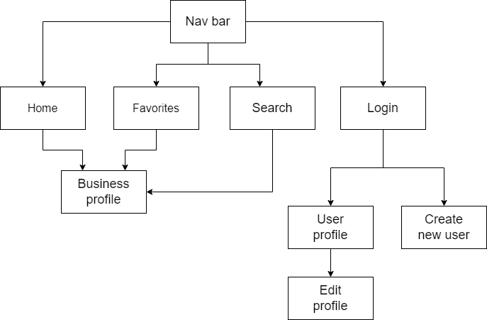

# Dog walk 

## A site to connect dog-owners with dog-walkers near them. 

### Overview:
The site was created as a Front-end final project for Appleseeds Full-stack bootcamp.

Base goals for this project were to build a CRUD Single Page Application (SPA) 
drawing data from a REST based API.

### Link to site on Netlify:

[https://dog-walk.netlify.app]

### Site map:

### Dependencies:

- React.js
- React-dom
- React-router-dom
- [Semantic-UI](https://semantic-ui.com/)
- [React-icons](https://react-icons.github.io/react-icons)

### Todo:

- Add free search
- Add tags for search
- Add authentication 
- Improve error handling to present specific error messages to screan
- Fix UI glitches
- Refactor code to improve readability
- Include more ideas for improvement

